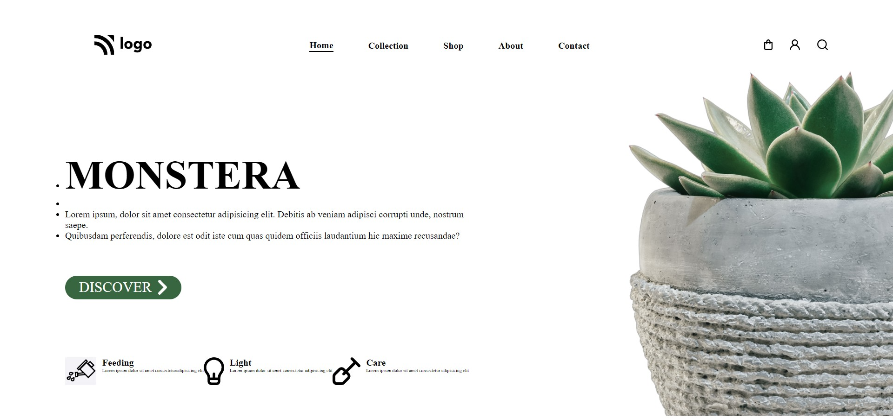

# Full Stack Javascript Bootcamp Assignment 

# Live Project 6 : Plant Home Page

## Project 6: (Mobile Responsive)
[Live Link](https://live-project-6-fs-js.netlify.app/)

-   Skills Gained in this project.
    - Learned to declared Internal stylesheets.
    - Learned to use object-fit property.
---

## Time taken to finish this project(including adding media queries)⏲

 >5 hours are needed to finish.

#### Screenshot

